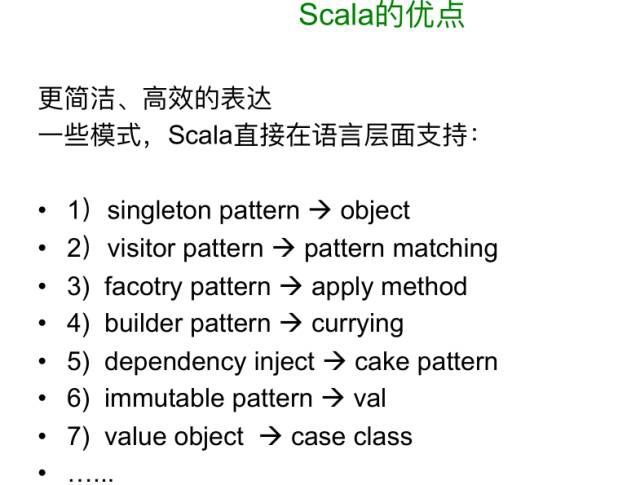
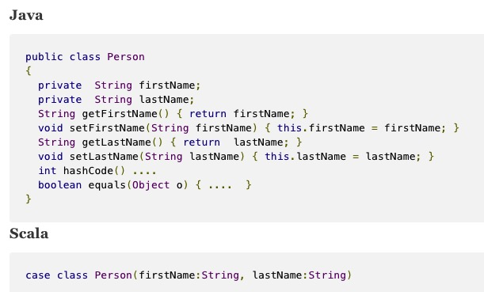
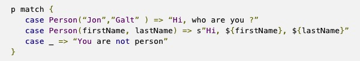
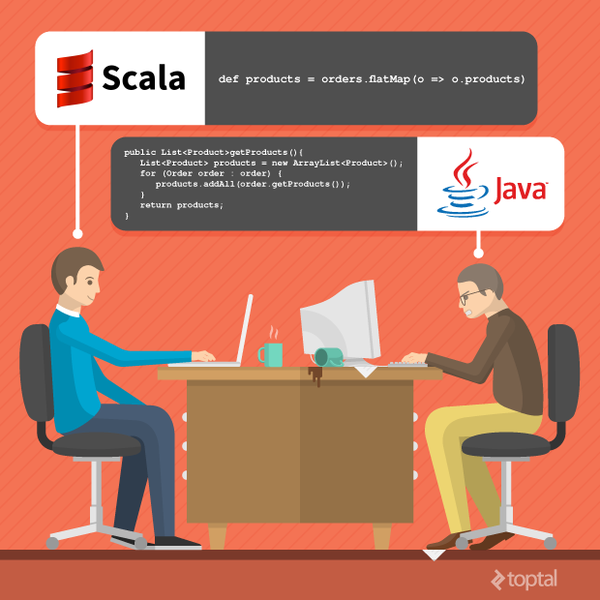
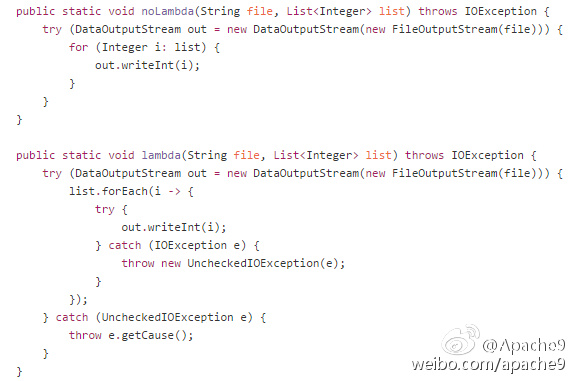
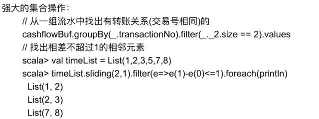
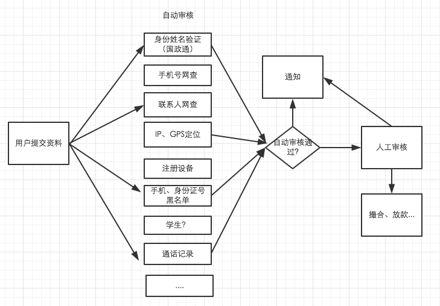

### Scala 实践（& vs Java）

#### 共同点
* JVM上的语言：性能、多线程、互操作性、GC
* 性能：编译成字节码运行，借助JVM JIT即时编译可获得比python、ruby相当大的性能优势
* 多线程：充分利用OS的线程能力，丰富的并发库
* 互操作性：Scala可以充分利用Java积累多年的第三方lib
* 强类型：类型不可更改，强大的编译器和IDE在编译期就能发现大部分错误，在运行期也能避免类型错误

#### Scala的优点
###### 高效表达


Java有太多样板代码，敲代码速度远远跟不上思维速度:)



case class用于模式匹配：



###### 函数式编程
Scala融合了OO和FP。函数式写法非常爽：



高阶函数用于AOP
```
检查用户是否登录，如果不登录返回401，否则进行正确业务处理
  protected def Auth(f: => Long => Request[AnyContent] => Result) = {
    Authenticated(getUserFromRequest, onUnauthorized) { userId =>
      Action(request => f(userId)(request))
    }
  }
  def show = Auth { userId => implicit request =>
  	...
  }

```

Java 8 Lambda：

 * lambda表达式不是一等公民，必须定义函数interface
 * 如果你改了一个参数和返回类型，就得重新定义一个
 * lambda无法实现闭包

Java 8 lambda蛋疼的异常处理



###### 容器操作：在数据处理方面非常高效

```
each, filter, map, reduce, foldLeft
```


###### 并发：Actor Model(Akka) vs 手工线程管理
Java并发编程相当复杂《Java并发编程》

一旦出现可变对象+竞态，很容易出现并发错误和死锁

Actor模型简单很多，每个Actor都是一个带状态、有处理逻辑的对象，跟线程解耦。

###### 不可变对象
不可变能解决函数式编程和并发编程问题.

Scala的容器大多数也都是不可变的

###### 其他大量好用的特性：
* 类型推断
* 模式匹配
* 命名参数
* lazy参数
* 隐式转换、隐式参数
* 宏
* 泛型（Scala作者是Java泛型的合作设计者）
* 操作符可作为函数名、纯OO（没有原生类型）、可省略括号 -> 特别适合DSL，可用用类似自然语言使用BigDecimal做金融计算（[雪球投资组合](http://www.infoq.com/cn/presentations/build-a-high-available-investment-portfolio-system)）

###### example 1：Future异步处理
```
def show = Action.async { implicit request =>
	val req = url(BACKEND_URL).GET 
	Http(req).map { resp =>
		val orderResp = Json.parse(resp).as[OrderResp]
		Ok(jsonOk(orderResp))
	}
}
```
###### example 2： 异步链式调用
```
def getUserByPhone(phone: String): Future[Option[User]]

def getOrdersByUserId(userId: Long): Future[Seq[Order]]

val phone = "13800138000"
for (user <- getUserByPhone(phone);
	 orders <- getOrdersByUserId(user.id)	
) yield orders
```
###### example 3： 使用Akka进行事件处理
风控流程：自动审核（10-20种不同类型的审核规则） -> 人工审核 -> 结果通知



```
reviewActor ! ReviewMsg(loanId)

notificationActor ! LentSuccMsg(userId, date)

class NotificationActor extends Actor {
	override def receive: Receive = {
		case LentSuccMsg(userId, date) => smsNotifier.notifyLentSucc(userId, date)
		case LentFailMsg(reason) => smsNotifier.notifyLentFail(userId, reason)		
	}
}
```

#### Scala技术栈
##### [Akka](http://akka.io/)
* Actor线程模型-简单高性能的并发编程模型
* 构建在Java线程池上（ThreadPoolExecutor、ForkJoinPool）
* 极其适合并发计算、事件处理、异步处理

##### [Play](https://www.playframework.com/)
* 高性能轻量级的Web框架（跟Spring相比）
* JSON库、Reactive异步、参数校验

```
  case class OrderCreateReq(symbol: String,
                            action: String,
                            quantity: Int,
                            orderType: String,
                            limitPrice: Option[BigDecimal] = None)

  val orderCreateReq = Form(
    mapping(
      "symbol" -> nonEmptyText,
      "action" -> nonEmptyText.verifying("买卖类型不正确", Seq("BUY", "SELL").contains(_)),
      "quantity" -> number(min = 1),
      "order_type" -> nonEmptyText.verifying("订单类型不正确", Seq("MKT", "LMT").contains(_)),
      "limit_price" -> optional(bigDecimal(20, 2).verifying("限价价格不正确", _ > 0.0))
    )(OrderCreateReq.apply)(OrderCreateReq.unapply)
  )
```
##### [slick](http://slick.typesafe.com/)
* Code Generator直接从数据库生成数据类、数据库操作的代码
* 使用容器方式操作数据库
* 强类型，字段的类型直接转换为Scala的对应类型
```
Tables.persons.filter(_.firstName === "Jon").map(_.lastName).sortBy(_.id).list
```

##### [Finagle](https://twitter.github.io/finagle/)
* twitter开源的网络框架，Future设计被吸收进了scala library
* twitter使用scala构建了大容量分布式系统

##### 众多第三方库
* [Awesome Scala](https://github.com/lauris/awesome-scala)

#### Scala的缺点
* 相对小众、语言强大也相对复杂
* 表达灵活，有时会影响可读性。需要编程规范，同时限制一些高级特性使用
* 编译比较慢

##### 总结
* 抛弃成见，拥抱变化，你会发现Scala是一门优秀的语言。
* Java让高手和新手写出差不多的代码，Scala则不在语言层面限制表达能力、限制生产力。
* 即便把Scala作为更好的Java来用，也会有很大收获。

#### 学习资料
* [Scala函数式程序设计](https://www.coursera.org/course/progfun) Scala作者课程
* [Scala Overview](http://docs.scala-lang.org/zh-cn/overviews/index.html)
* [快速了解Scala技术栈](http://www.infoq.com/cn/articles/scala-technology)
* [Scala课堂](http://twitter.github.io/scala_school/zh_cn/index.html)
* [Effective Scala](http://twitter.github.io/effectivescala/index-cn.html)
* [Scala在挖财的应用实践](http://mp.weixin.qq.com/s?__biz=MjM5MDE0Mjc4MA==&mid=402054624&idx=1&sn=d94ecfdce7c97c57341911819b4ea32a&scene=23&srcid=0106xfD56RGUxb8NawWKO8hB#rd)
